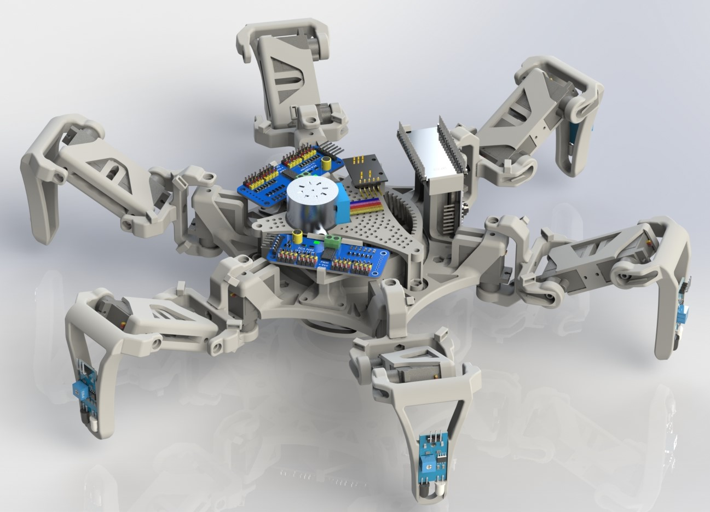

# Hungry Crab
Hungry Crab is an open source project which consists of a medium sized hexapod that can pick up small objects from the floor and transport them to a nearby location.

## CAD Files
* Pending upload.

## Companion App

This project includes an app to control the Hungry Crab with serial communication via Bluetooth.

## Necessary Electronics
* 1  x NodeMCU-32S Microcontroller
* 2  x 18650 Batteries *(recommendation: INR18650-35E SAMSUNG)*
* 18 x MG90S servomotors
* 2  x 12 channel servomotor drivers PCA9685
* 1  x UBEC @ 5V/5A
* 2  x UBEC @ 6V/3A
* 1  x 28BYJ-48 Stepper motor

For now, the following rough electronic diagram lays out how the different components are connected:

## Hungry Crab Capabilities

An example of each capability will be shown but bear in mind that the GIFs are speed up 2x.

* Walk in all directions

* Rotate Clockwise
* Rotate Counter Clockwise

* Change height
* Open and close mouth to pick up objects

